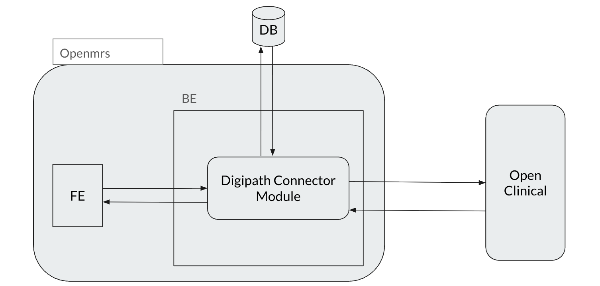
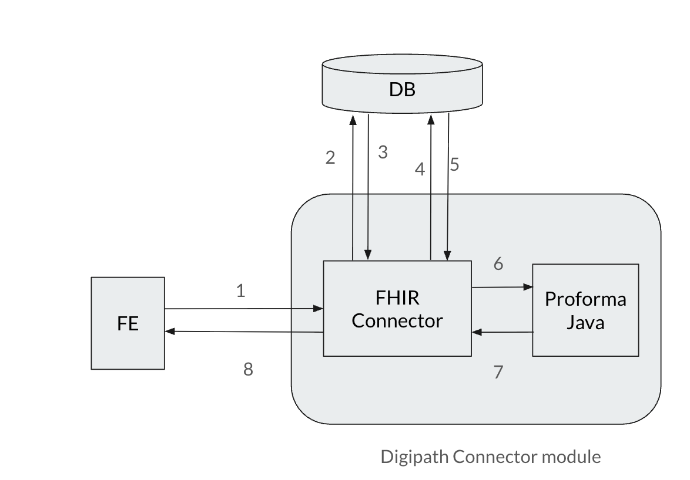
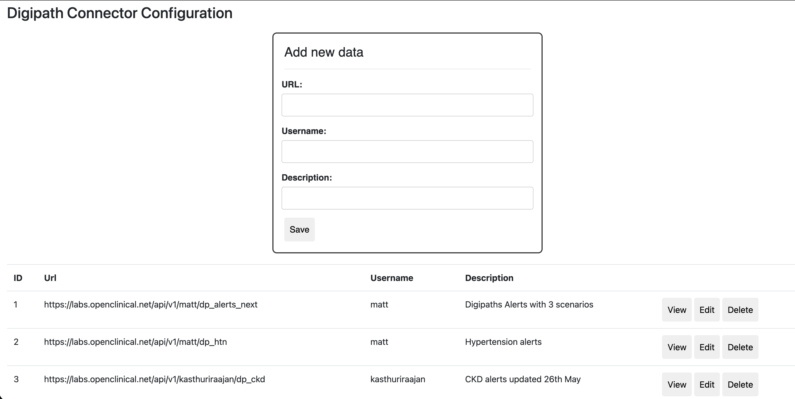

# Digipaths Connector for OpenMRS

The **Digipaths Connector** is an OpenMRS module that integrates **OpenMRS** with the **Open Clinical** platform to provide clinical decision support.

The connector retrieves active clinical protocols from Open Clinical, converts OpenMRS patient data into **FHIR** resources, evaluates the data against clinical rules using the **Proforma Java Library**, and displays patient-specific recommendations within OpenMRS.

---

## Table of Contents

* [Overview](#overview)
* [Architecture](#architecture)
* [Data Flow](#data-flow)
* [Workflow](#workflow)
* [Key Features](#key-features)
* [FHIR Resource Mapping](#fhir-resource-mapping)
* [Configuration](#configuration)
* [Recommendation Screen](#recommendation-screen)
* [Technology Stack](#technology-stack)
* [Database](#database)
* [Development](#development)
* [Contributing](#contributing)

---

## Overview

The Digipaths Connector acts as an integration layer between **OpenMRS** and **Open Clinical**.

It enables clinicians to request clinical decision support recommendations directly from an OpenMRS patient record.

The connector performs the following major functions:

1. Synchronises active clinical protocols from Open Clinical.
2. Retrieves patient demographics and clinical information from OpenMRS.
3. Maps OpenMRS data to FHIR resources.
4. Executes clinical rules using the Proforma engine.
5. Generates patient-specific recommendations.
6. Displays recommendations within the OpenMRS interface.

---

## Architecture

The system consists of the following main components:



### Component Responsibilities

| Component              | Responsibility                                                                               |
|------------------------|----------------------------------------------------------------------------------------------|
| **Open Clinical** | Creates and manages clinical protocols used for clinical decision support. |
| **Frontend** | Provides the patient dashboard interface for displaying Digipaths recommendations to clinicians. |
| **Backend** | Provides the OpenMRS backend environment, loads the OpenMRS modules, and handles server-side application logic. |
| **Digipaths Connector** | Integrates OpenMRS with Open Clinical, synchronises clinical protocols, maps patient data to FHIR resources, and executes clinical rules. |
| **Database** | Stores OpenMRS patient and clinical data, along with connector configuration and synchronised clinical protocols. |
---

## Data Flow


---

## Workflow

The typical workflow for requesting clinical recommendations is:

### 1. Request Digipath Alert

A clinician opens a patient record in OpenMRS and requests clinical recommendations.

### 2. Retrieve Active Protocols

The Digipaths Connector loads the currently active clinical protocols that have been synchronised from Open Clinical and stored locally.

### 3. Query Patient Data

The connector retrieves the required patient information from OpenMRS, including demographics and relevant clinical data.

### 4. Convert Patient Data to FHIR

The retrieved OpenMRS data is mapped to appropriate FHIR resources using the connector's FHIR mapping layer.

### 5. Execute Clinical Rules

The FHIR patient data is provided to the **Proforma Java Library**, which evaluates the data against the active clinical protocols.

### 6. Generate Recommendations

The Proforma engine returns the clinical rules and recommendations that match the patient's available data.

### 7. Display Results

The generated recommendations are displayed to the clinician through the OpenMRS patient dashboard.

---


## Key Features

* **OpenMRS Integration**

    * Integrates directly with the OpenMRS platform.
    * Retrieves patient information from OpenMRS.

* **Open Clinical Integration**

    * Connects to the Open Clinical API.
    * Downloads and synchronises active clinical protocols.

* **FHIR-Compliant Data Mapping**

    * Converts OpenMRS clinical data into FHIR resources.
    * Provides a standardised representation of patient information for rule evaluation.

* **Clinical Rule Execution**

    * Uses the Proforma Java Library to execute clinical decision-support rules.

* **Patient-Specific Recommendations**

    * Evaluates patient data against active protocols.
    * Returns recommendations relevant to the individual patient.

* **OpenMRS Dashboard Integration**

    * Displays triggered protocols and recommendations within the OpenMRS user interface.

* **Manual Protocol Synchronisation**

    * Supports synchronisation of protocols from Open Clinical.

---

## FHIR Resource Mapping

The connector maps OpenMRS entities to corresponding FHIR resources.

| OpenMRS Entity | FHIR Resource       |
| -------------- | ------------------- |
| Patient        | `Patient`           |
| Encounter      | `Encounter`         |
| Observation    | `Observation`       |
| Diagnosis      | `Condition`         |
| Medication     | `MedicationRequest` |

### Mapping Process

```text
OpenMRS Clinical Data
        │
        ▼
   FHIR Mapper
        │
        ▼
FHIR Resources
        │
        ▼
Proforma Rule Engine
```

This mapping allows the Proforma engine to evaluate clinical information using a standardised FHIR-based data model.

---

## Configuration

Before using the Digipaths Connector, an administrator must configure the connection to the Open Clinical platform.

### Admin UI 


---

### Required Configuration

| Configuration                  | Description                                      |
|--------------------------------|--------------------------------------------------|
| **Open Clinical API Endpoint** | URL of the Open Clinical API                     |
| **Username**                   | Username used to authenticate with Open Clinical |
| **Description**                | Description of Open Clinical API for more info   |

> **Note:** Additional authentication or configuration properties may be required depending on the Open Clinical deployment.

### Protocol Synchronisation

While adding the new open clinical endpoint , it can retrieve active protocol schema from Open Clinical.

The downloaded schema is stored locally in the OpenMRS database, allowing them to be used when evaluating patient data.

---

## Database

The connector uses the OpenMRS database to store configuration and synchronised protocol information.

The protocol data is stored in:

```text
digipath_connector
```

The database is used to maintain locally available clinical protocols and connector-related configuration.

---

## Recommendation Screen

The recommendation panel is displayed within the OpenMRS patient workflow.

It provides clinicians with relevant clinical decision-support information based on the patient's data and the configured clinical protocols.

### The recommendation screen displays

* Triggered clinical protocols
* Patient-specific recommendations
* Clinical decision-support messages
* Relevant rule outcomes

## Main Responsibilities

The Digipaths Connector is responsible for:

### Protocol Synchronisation

Retrieves active clinical protocols from Open Clinical and makes them available within OpenMRS.

### Patient Data Retrieval

Retrieves relevant demographic and clinical information from OpenMRS.

### FHIR Mapping

Converts OpenMRS entities into standardised FHIR resources.

### Rule Execution

Provides the FHIR patient data and clinical protocols to the Proforma engine for evaluation.

### Recommendation Generation

Processes the rule-engine output and identifies applicable clinical recommendations.

### OpenMRS Integration

Displays the resulting recommendations within the OpenMRS patient dashboard.

---

## Technology Stack

The project is built using the following technologies:

| Technology                | Purpose                                                         |
| ------------------------- | --------------------------------------------------------------- |
| **Java**                  | Primary programming language                                    |
| **OpenMRS**               | Electronic medical record platform                              |
| **FHIR**                  | Standard for representing and exchanging healthcare information |
| **Proforma Java Library** | Clinical rule evaluation                                        |
| **Open Clinical API**     | Clinical protocol integration                                   |
| **OpenMRS Database**      | Local storage for configuration and synchronised protocols      |

---

## Project Structure

A typical OpenMRS module follows a structure similar to:

```text
digipaths-connector/
├── api/
│   └── src/
├── omod/
│   └── src/
├── pom.xml
└── README.md
```

> The exact project structure may vary depending on the current implementation.

---

## Development

### Prerequisites

Before developing or building the module, ensure you have:

* Java Development Kit (JDK) minimum 11
* Maven
* A running OpenMRS installation
* Access to an Open Clinical instance
* Access to an OpenMRS database

### Build

The project can be built using Maven:

```bash
mvn clean install
```

The resulting OpenMRS module (`.omod`) can then be deployed to the appropriate OpenMRS installation.

> Update the build and deployment instructions here if the project uses a specific Maven profile, OpenMRS SDK command, or deployment process.

---

## Clinical Decision Support Flow

The complete clinical decision-support process can be summarised as:

```text
┌──────────────────────┐
│  Clinician opens     │
│  patient record      │
└──────────┬───────────┘
           │
           ▼
┌──────────────────────┐
│ Request Digipath     │
│ recommendations      │
└──────────┬───────────┘
           │
           ▼
┌──────────────────────┐
│ Load active clinical │
│ protocols             │
└──────────┬───────────┘
           │
           ▼
┌──────────────────────┐
│ Retrieve patient     │
│ data from OpenMRS    │
└──────────┬───────────┘
           │
           ▼
┌──────────────────────┐
│ Convert OpenMRS data │
│ to FHIR resources    │
└──────────┬───────────┘
           │
           ▼
┌──────────────────────┐
│ Proforma rule engine │
│ evaluates patient    │
│ data                 │
└──────────┬───────────┘
           │
           ▼
┌──────────────────────┐
│ Generate clinical    │
│ recommendations      │
└──────────┬───────────┘
           │
           ▼
┌──────────────────────┐
│ Display results in   │
│ OpenMRS dashboard    │
└──────────────────────┘
```

---

## Summary

The **Digipaths Connector for OpenMRS** provides an integration layer between OpenMRS and Open Clinical for clinical decision support.

By combining:

* OpenMRS patient data
* FHIR-based data mapping
* Open Clinical protocols
* Proforma rule execution

the connector enables clinicians to receive **protocol-based, patient-specific clinical recommendations directly within OpenMRS**.

The overall process is:

```text
Open Clinical Protocols
          +
     OpenMRS Data
          │
          ▼
    FHIR Mapping
          │
          ▼
 Proforma Rule Engine
          │
          ▼
 Clinical Recommendations
          │
          ▼
    OpenMRS Dashboard
```

---

## Contributing

Contributions, improvements, bug reports, and feature requests are welcome.

When contributing:

1. Create a feature branch.
2. Make your changes.
3. Add or update tests where applicable.
4. Verify that the project builds successfully.
5. Submit a pull request with a clear description of the changes.

---